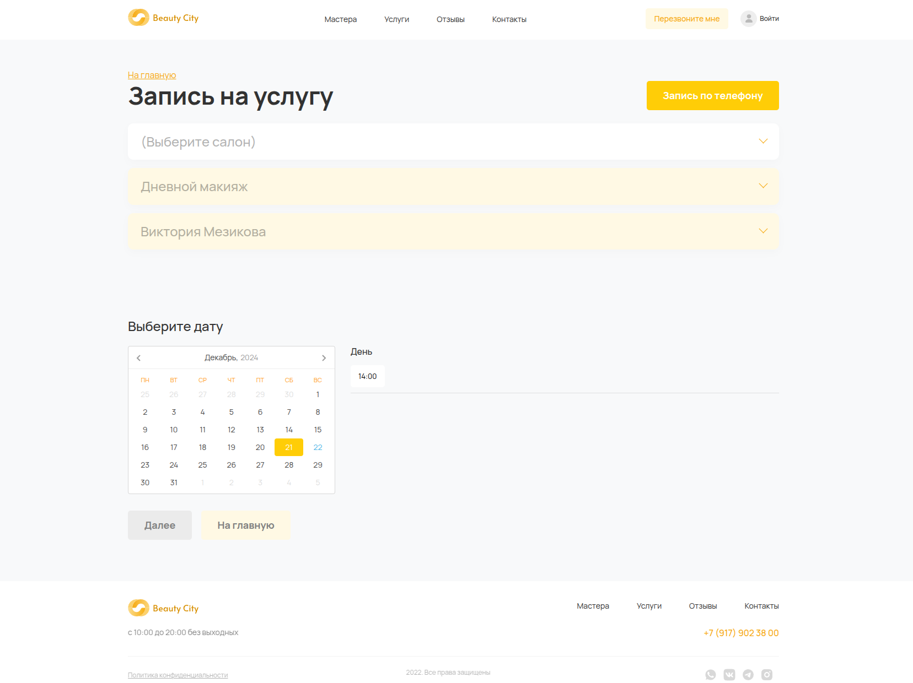
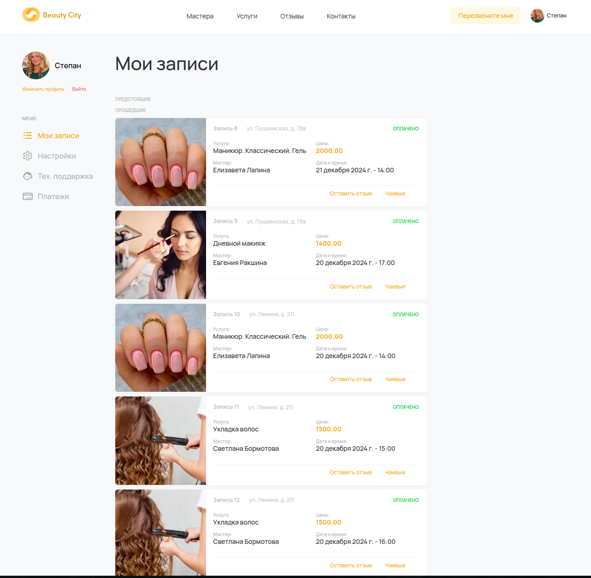

# Сайт салонов красоты Beauty City

На сайте реализован функционал записи на услуги, а также личный кабинет.





## Как запустить

### Создание `.env`
Создайте `.env`. Его содержимое должно быть следующим:

```dotenv
SECRET_KEY="django-insecure...<Secret Key Django>"
DEBUG=True <Режим отладки>
ALLOWED_HOSTS=[<адрес сайта>]
```


### Установка зависимостей
Создайте и активируйте виртуальное окружение.
```
python -m venv .venv
```

После чего активируйте его:
```
source .venv/bin/activate : Linux
.venv\Scripts\activate : Windows
```
После чего скачайте все зависимости
```
pip install -r requirements.txt
```

### Запуск сервера
```
python manage.py runserver 0.0.0.0:8000
```